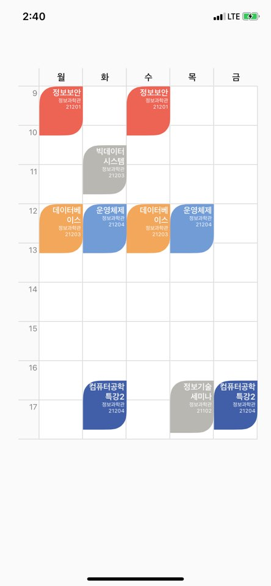

# Elliotable
Elliotable is simple library to generate Timetable of University.   
If you only add a course, the course time is automatically calculated and added to the timetable.   

### Author Information
Timetable Library for iOS Development   
Author : Elliott Kim / Seoul, South Korea   
Feedback : della.kimko@gmail.com   
   
[](http://cocoapods.org/pods/Elliotable)
[](http://cocoapods.org/pods/Elliotable)
[](http://cocoapods.org/pods/Elliotable)
[](http://cocoapods.org/pods/Elliotable)
[](http://cocoapods.org/pods/Elliotable)

## Installation

### Cocoapods
Elliotable is available through CocoaPods, to install it simply add the following line to your Podfile:   
```ruby
pod 'Elliotable'
```

## Usage   
### Day Symbol Definition   
```swift
private let daySymbol = ["Mon", "Tue", "Wed", "Thu", "Fri"]   
```
### Item Click Handler Implementaion    
```swift
let handler = { (course: ElliottEvent) in   
    print(course.courseName, course.courseDay)   
}   
```

### Course Item Structure   
```swift
courseId : The identifier of the course   
courseName : The name of the course
roomName : The name of the lecture room
courseDay : Weekday of the course
startTime : Start time of course (String type - format : "HH:mm")
endTime : End time of course (String type - format : "HH:mm")
backgroundColor : backgroud color of each course item
(Optional) textColor: Course Item Text Color
tapHandler : on Touch Event Listener for each course item.
```

### How to use   
On your storyboard, just add a "View" Component.     
On the Inspector Frame, choose the View class to "Elliotable"   
   
This is screenshot how to bind the view into swift file.   
   


First, import my library by adding line below.   
```swift
import Elliotable
```
And then, create courses to add to the timetable.   
```swift
let course_1 = ElliottEvent(courseId: "c0001", courseName: "Operating System", roomName: "IT Building 21204", courseDay: .tuesday, startTime: "12:00", endTime: "13:15", backgroundColor: [UIColor], tapHandler: handler)

let course_2 = ElliottEvent(courseId: "c0002", courseName: "Operating System", roomName: "IT Building 21204", courseDay: .thursday, startTime: "12:00", endTime: "13:15", textColor: UIColor.white, backgroundColor: [UIColor], tapHandler: handler)
```
Finally, define the properties of the timetable.   
```swift
@IBOutlet var elliotable: Elliotable!

// Course Item List & Day Symbol
elliotable.courseItems = [course_1, course_2, course_3, course_4, course_5, course_6, course_7, course_8, course_9, course_10]
```

```swift
// Course Item Round Option : .none, .all, .left(topLeft, bottomRight), .right(topRight, bottomLeft)
elliotable.roundCorner   = .none
```
 

```swift
elliotable.userDaySymbol = daySymbol     
// Table Item Properties
elliotable.elliotBackgroundColor = UIColor.white
elliotable.borderWidth        = 1
elliotable.borderColor        = UIColor(red: 0.85, green: 0.85, blue: 0.85, alpha: 1.0)
elliotable.borderCornerRadius = 24

// Course Item Properties
elliotable.textEdgeInsets = UIEdgeInsets(top: 2, left: 3, bottom: 2, right: 10)
elliotable.courseItemMaxNameLength = 18
elliotable.courseItemTextSize      = 12.5
elliotable.courseTextAlignment     = .left
elliotable.roomNameFontSize        = 8

// courseItemHeight - default : 60.0
elliottable.courseItemHeight       = 70.0

// Day Symbol & Leftside Time Symbol Properties
elliotable.symbolFontSize = 14
elliotable.symbolTimeFontSize = 12
elliotable.symbolFontColor = UIColor(displayP3Red: 0.1, green: 0.1, blue: 0.1, alpha: 1.0)
elliotable.symbolTimeFontColor = UIColor(displayP3Red: 0.5, green: 0.5, blue: 0.5, alpha: 1.0)
elliotable.symbolBackgroundColor = UIColor(named: "main_bg") ?? .white  
```


### Screenshot   
#### Course Item Rounded Corner

#### Rounded Corner TimeTable   
   
#### Non-Rounded Corner TimeTable   

