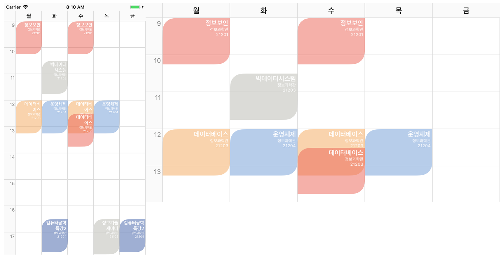
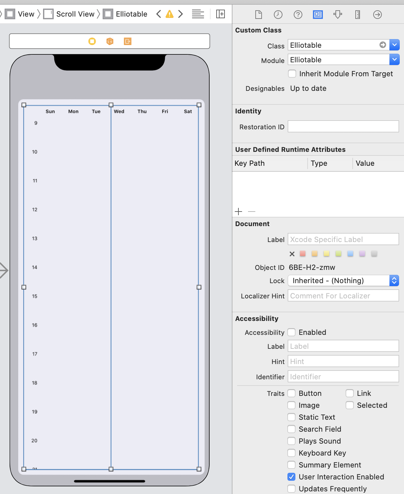
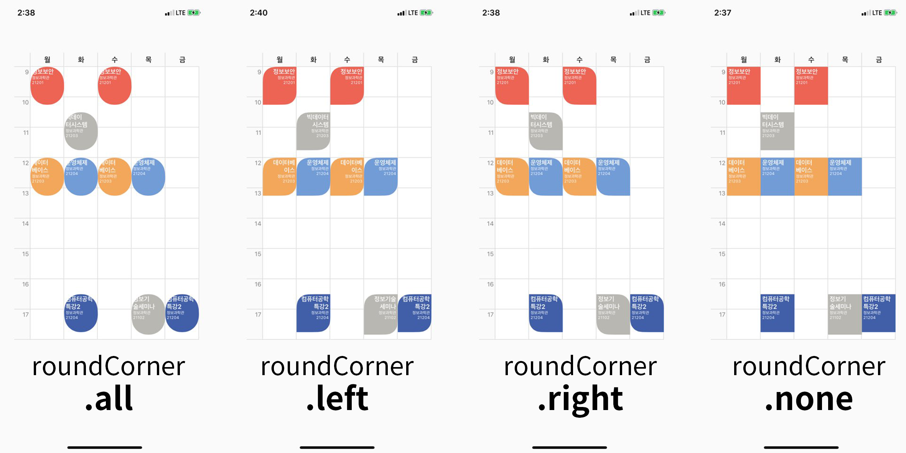
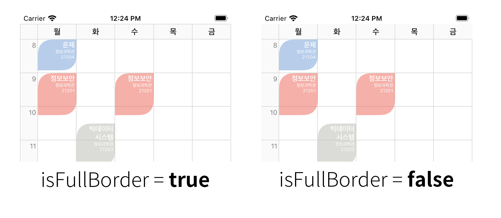

# Elliotable
Elliotable is simple library to generate **Timetable** of University.   
If you only add a course, **the course time is automatically calculated** and added to the timetable.   

### What's New in v1.2.4  
- Implementation of Event Delegate, Data Source Delegate Pattern  
- Scrolling Issue Resolved  
  
  
## Korean Version     
Click the link below to view the Korean version READMD.md.   
[한국어 사용 가이드](./README_kr.md)   

## Android Version    
[MinTimetable](https://github.com/islandparadise14/MinTimetable)    

## Author Information  
Timetable Library for iOS Development   
Author : Elliott Kim / Seoul, South Korea   
Email : della.kimko@gmail.com   
Blog : https://terry-some.tistory.com/
Newest Version : 1.2.4 (Cocoapods)  
  
[](http://cocoapods.org/pods/Elliotable)
[](http://cocoapods.org/pods/Elliotable)
[](http://cocoapods.org/pods/Elliotable)
[](http://cocoapods.org/pods/Elliotable)
[](http://cocoapods.org/pods/Elliotable)

## Screenshot   

#### Portrait & Landscape Timetable   
   

## Installation  
### Cocoapods
Elliotable is available through CocoaPods, to install it simply add the following line to your Podfile:   
```ruby
pod 'Elliotable'
```

## Usage     

### Course Item Structure   
```swift
courseId : The identifier of the course   
courseName : The name of the course
roomName : The name of the lecture room
courseDay : Weekday of the course
startTime : Start time of course (String type - format : "HH:mm")
endTime : End time of course (String type - format : "HH:mm")
backgroundColor : backgroud color of each course item
(Optional) textColor: Course Item Text Color
```

### How to use   
On your storyboard, just add a **View** Component.     
On the Inspector Frame, choose the View class to **Elliotable**   
   
This is screenshot how to bind the view into swift file.   
   


First, import my library by adding line below.   
```swift
import Elliotable
```
And then, create courses to add to the timetable.   
```swift
let course_1 = ElliottEvent(courseId: "c0001", courseName: "Operating System", roomName: "IT Building 21204", courseDay: .tuesday, startTime: "12:00", endTime: "13:15", backgroundColor: [UIColor])

let course_2 = ElliottEvent(courseId: "c0002", courseName: "Operating System", roomName: "IT Building 21204", courseDay: .thursday, startTime: "12:00", endTime: "13:15", textColor: UIColor.white, backgroundColor: [UIColor])
```
Finally, define the properties of the timetable.   
```swift
@IBOutlet var elliotable: Elliotable!
```

## Delegate Pattern  
Elliotable uses Delegate Pattern.  
```swift
class ViewController : UIViewController, ElliotableDelegate, ElliotableDataSource {

}
```
```swift
// Delegate Pattern  
elliotable.delegate = self  
elliotable.dataSource = self
```  
## Course Item Application   
To apply the course, please use the courseItems method among the Delegate methods.  
```swift
// Set course Items
func courseItems(in elliotable: Elliotable) -> [ElliottEvent] {  
    return courseList  
}  
```  
## Update Course Item   
If you change the course item, you should call the reloadData function to allow new data to be applied.  
```swift
elliotable.reloadData()  
```
  
## Course Item Event Listener   
There are two touch events for lecture items, a regular touch event and a long touch event.  
```swift
// Course Tap Event  
func elliotable(elliotable: Elliotable, didSelectCourse selectedCourse: ElliottEvent) { }  

// Course Long Press Event  
func elliotable(elliotable: Elliotable, didLongSelectCourse longSelectedCourse : ElliottEvent) { }  
```
## Course Item Round Corder Option Configuration   
If you want to process the round for the lecture item, you can apply the following options.  
```swift
// Course Item Round Option : .none, .all, .left(topLeft, bottomRight), .right(topRight, bottomLeft)
elliotable.roundCorner   = .none
```
 
  
## Day Symbol Definition   
```swift
private let daySymbol = ["Mon", "Tue", "Wed", "Thu", "Fri"]   
```  
  
## Day Section Configuration  
The section representing the day of the week can be implemented using textPerIndex and numberOfDays.  
```swift
func elliotable(elliotable: Elliotable, at textPerIndex: Int) -> String {  
    return self.daySymbol[textPerIndex]  
}  
  
func numberOfDays(in elliotable: Elliotable) -> Int {  
    return self.daySymbol.count  
}  
```  
  
## Border Option Configuration  
To apply the timetable border properties, you can apply them as follows. For the result screen, see screenshots.  
```swift
// Full Border Option
elliotable.isFullBorder = true
```
 

Other Timetable Properties  
```swift   
// Table Item Properties
elliotable.elliotBackgroundColor = UIColor.white
elliotable.borderWidth        = 1
elliotable.borderColor        = UIColor(red: 0.85, green: 0.85, blue: 0.85, alpha: 1.0)

// Course Item Properties
elliotable.textEdgeInsets = UIEdgeInsets(top: 2, left: 3, bottom: 2, right: 10)
elliotable.courseItemMaxNameLength = 18
elliotable.courseItemTextSize      = 12.5
elliotable.courseTextAlignment     = .left
// Course Item Round Radius
elliotable.borderCornerRadius = 24
elliotable.roomNameFontSize        = 8

// courseItemHeight - default : 60.0
elliottable.courseItemHeight       = 70.0

// Day Symbol & Leftside Time Symbol Properties
elliotable.symbolFontSize = 14
elliotable.symbolTimeFontSize = 12
elliotable.symbolFontColor = UIColor(displayP3Red: 0.1, green: 0.1, blue: 0.1, alpha: 1.0)
elliotable.symbolTimeFontColor = UIColor(displayP3Red: 0.5, green: 0.5, blue: 0.5, alpha: 1.0)
elliotable.symbolBackgroundColor = UIColor(named: "main_bg") ?? .white  
```

